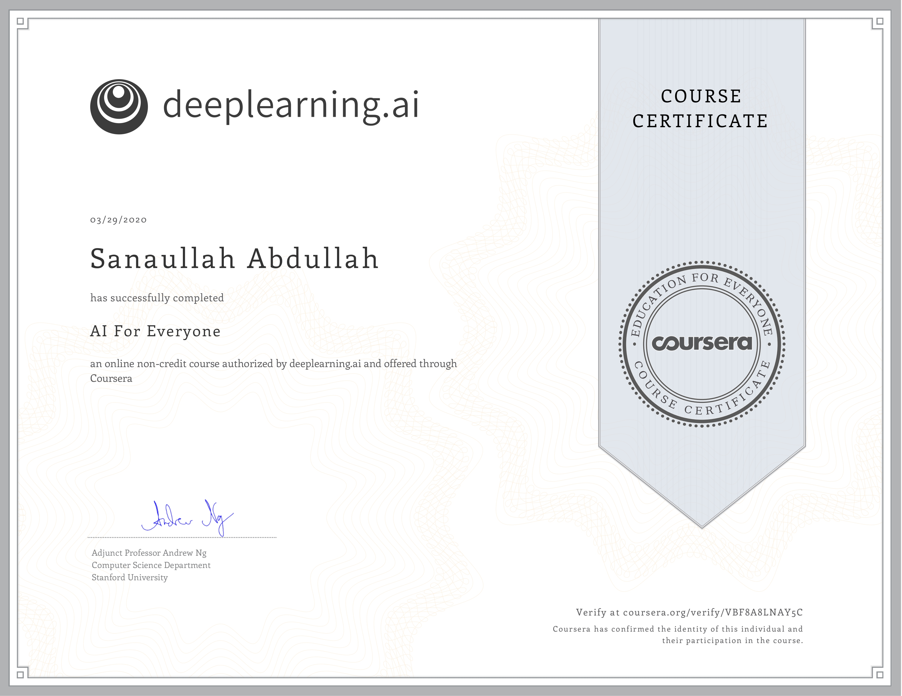
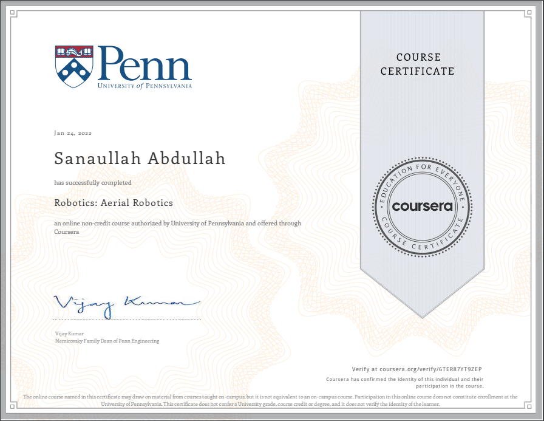
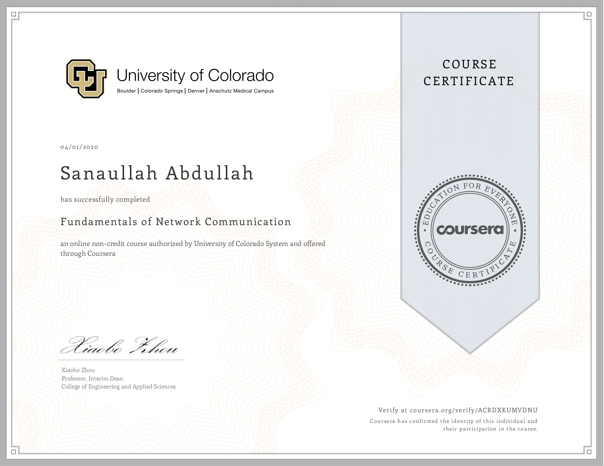
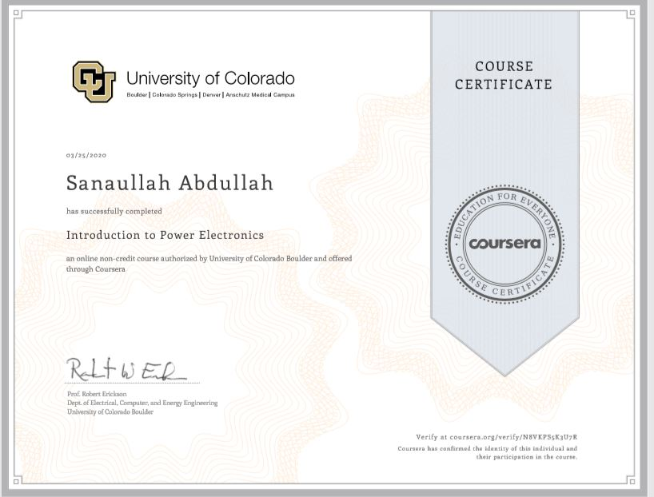
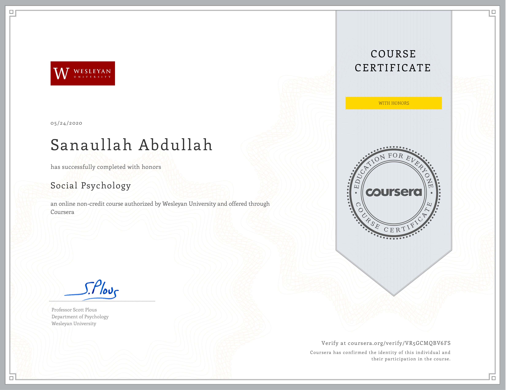

# 🚀 From Electrical Engineering to AI & Robotics – My Journey 

**Hi there! 👋 I'm Sanaullah**, a passionate **Master of Science in Computer Science** student specializing in **Artificial Intelligence**. My journey into AI and robotics began with an Electrical Engineering degree from Sukkur IBA University, where I developed a strong foundation in embedded systems and automation.

After graduating, I stepped into academia as a Robotics and AI Instructor for vocational training courses. This role sparked my curiosity about intelligent systems and their real-world applications. However, two key experiences fueled my transition into Computer Science:

- **📌 Teaching Vocational Courses in Robotics & AI –** While instructing students, I realized the immense potential of AI in shaping the future of automation, which deepened my interest in machine learning and intelligent systems.
- **📌 Research Associate at Sukkur IBA University –** My role in developing an **AI-based Flood Alert Chatbot** introduced me to real-world AI applications, where I explored **natural language processing (NLP), machine learning, and data-driven decision-making**.

### 🎓 Education
- **Master of Science in Computer Science**
  - *Sukkur Iba University*
  - **Major Subjects**
  - *NLP*
  - *AML*
  
- **Bachelor of Electrical Engineering**
  - *Sukkur Iba University*
  - **Major Subjects**
  - *Fundamental of Robotics*
  - *Introduction to Artificial Intelligence*
  - *Digital System Design*
  - *Programming Logic Control*

### 👨‍💻 Professional Experience
- **Research Associate | Sukkur IBA University**
  - *October 20, 2023 - Present*
  - As a Research Associate, I'm involved in:
    - Literature Review
    - Data Collection & Analysis
    - Implementation and Development of an AI-based chatbot
    - Experimentation & Testing
    - Documentation

- **Robotics and AI Instructor | Sukkur IBA University**
  - *March 7, 2022 - September 6, 2022*
  - As a Robotics and AI Instructor, I:
    - Conducted classes on Robotics and Artificial Intelligence
    - Designed and delivered an engaging curriculum
    - Mentored and guided students in practical projects
    - Contributed to the development of educational materials

### 🏆 Certificates
- 
  - *Issued by Coursera.org authorized by deeplearning.ai*
  - *Date: March 2022*
 
    
- 
  - *Issued by Coursera.org authorized by University of Pennsylvania*
  - *Date: January 2022*

- 
  - *Issued by Coursera.org authorized by Georgia Institute of Technology*
  - *Date: March 2020*
    

 
- 
  - *Issued by Coursera.org authorized by University of Colorado*
  - *Date: April 2020*
 
    
- 
  - *Issued by Coursera.org authorized by University of Colorado*
  - *Date: March 2020*
 
- 
  - *Issued by Coursera.org authorized by University of Wesleyan*
  - *Date: May 2020*
 

### 🌱 Always Learning
I thrive on being an enthusiastic learner, and I'm currently exploring the fascinating worlds of AI and robotics. My curiosity drives me to stay updated on the latest advancements in these fields.

### 🚀 Let's Connect
Feel free to explore my repositories and connect with me. I'm always open to collaborations, discussions, and learning from the amazing GitHub community.

Happy coding! 🚀
