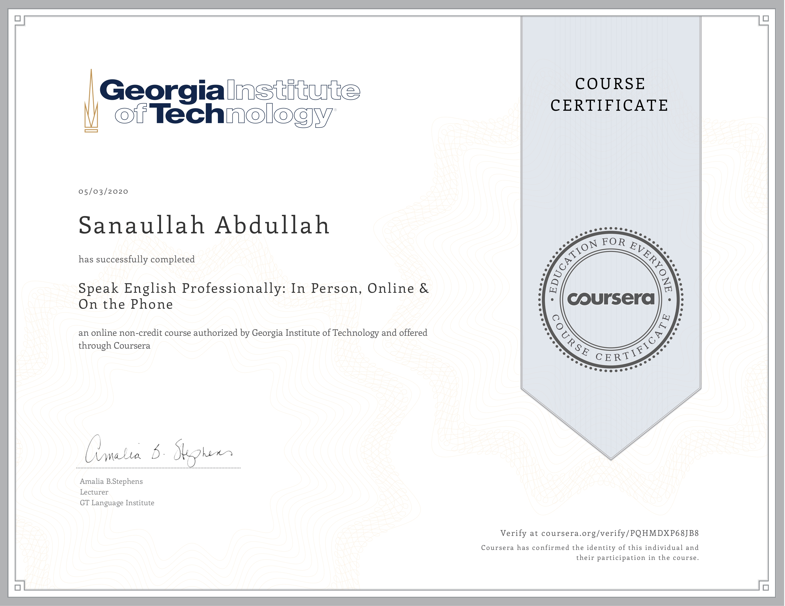
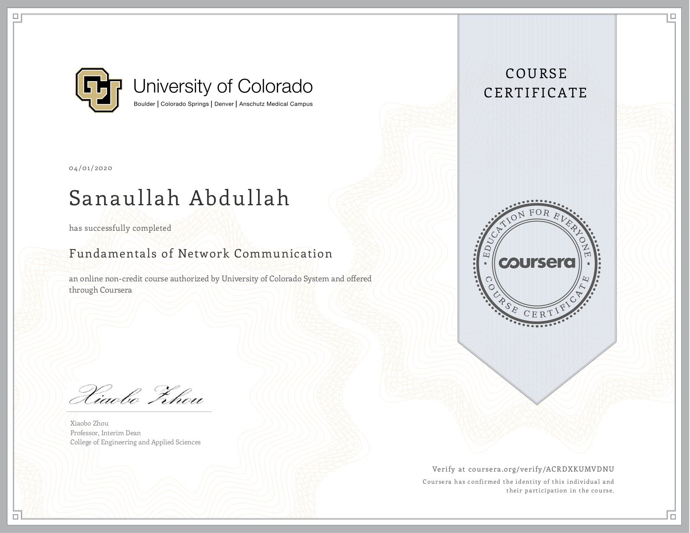
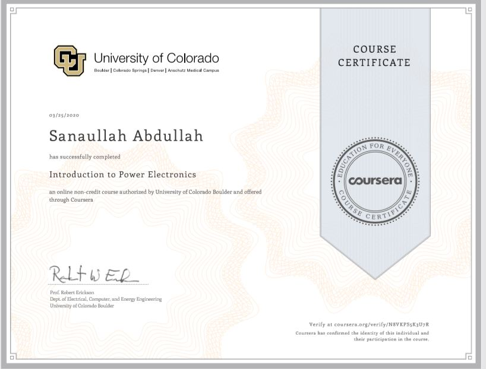

### 🏆 Certificates
- 
  - *Issued by Coursera.org, authorised by deeplearning.ai*
  - *Date: March 2022*
 
    
- 
  - *Issued by Coursera.org, authorised by the University of Pennsylvania*
  - *Date: January 2022*

- 
  - *Issued by Coursera.org, authorised by Georgia Institute of Technology*
  - *Date: March 2020*
    

 
- 
  - *Issued by Coursera.org, authorised by the University of Colorado*
  - *Date: April 2020*
 
    
- 
  - *Issued by Coursera.org, authorised by the University of Colorado*
  - *Date: March 2020*
 
- 
  - *Issued by Coursera.org, authorised by the University of Wesleyan*
  - *Date: May 2020*
